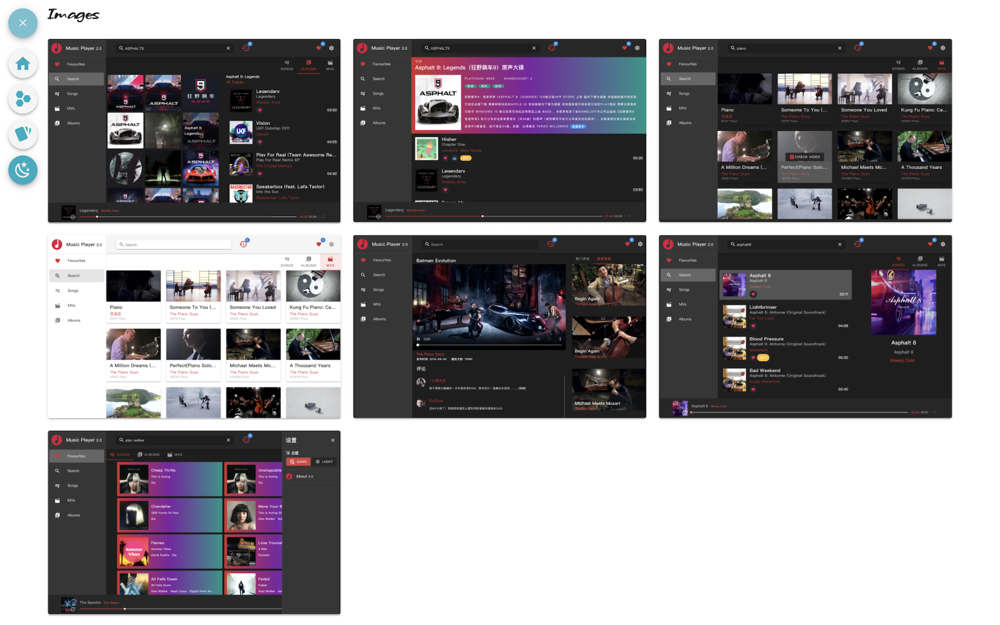

## Portofolio-Version-4

### About This
Vue **SPA**
Responsive Protofilo, 

created by **Vue2** + Vue-Cli + Vuetify + Vue-Router,
and used **Axios** to get JSON data from public files.

---

### Tech Stacks
    - Vue2
    - Vue-cli
    - Vue-Router
    - Vuetify
    - Scss
    - Axios
    - JSON
    - vue-lazyload
    - vue-carousel
    - vue-typer
    - Material Design icons
---

### SPA Routes
#### `/home`
#### `/profile`
#### `/skills`
#### `/works`
#### `/detail/skill`
#### `/detail/work`
#### `/versions`

---

---

### Function and Details
#### 1. Home Page
1. About me  
    - -> Profile page
    - -> Concat links
3. Skills 
    - -> Skills Page
    - -> Detail about one Skill 
4. Works
    - -> Works Page
    - -> Detail about one Work
5. Concat
    - -> Concat links
    - -> version

#### 2. Profile Page
1. Short Info about me 
2. Experience
3. Skills
    - -> Detail about one Skill 
4. Concat
    - -> Concat links
    - -> Protofolio Versions

---

#### 3. Skills Page
1. show all skills
    - -> Detail about one Skill 
2. Concat
    - -> Concat links
    - -> version

---

#### 4. Works Page
1. show all works
    - -> Detail about one Skill 
2. Concat
    - -> Concat links
    - -> version

---

#### 5. Detail Skill Page
1. desc about this skill
2. Tech Task 
3. works
    - -> Detail about one work
4. Concat
    - -> Concat links
    - -> version

---

#### 6. Detail Work Page
1. Slider example pics of this work
2. Tech Task 
    - -> github
    - -> online demo
3. function and details
4. Concat
    - -> Concat links
    - -> version

---

